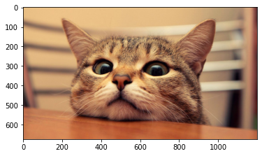

# Helpers
> various helpers from nic gist


full docs here
https://thanakijwanavit.github.io/nicHelper/

```python
from nicHelper.wrappers import add_method
```

## Install

`pip install nicHelper`

# How to use

## method module

### add method to a class

```python
class A:
  pass

@add_method(A)
def printHello(self):
  print('hello')
 
A().printHello()
```

    hello


This is equivalent to 
```
class A:
  def printHello(self):
    print('hello')
  
```

## Dict utilities

### Pretty print a dict
print only the first 10 characters of dict key, works with deep nested dict

```python
from nicHelper.dictUtil import printDict
printDict({'key':'sjfhdkljhafsdlkjhdfaslkjhkljfadshklhfa', 'nestedKey':{'nestedKey2':'938023840843', 'nested3':{'nested4':'hello'}}})
```

    key : sjfhdkljha
    nestedKey
     nestedKey2 : 9380238408
     nested3
      nested4 : hello


## Exception module

```python
from nicHelper.exception import errorString
try:
  error
except:
  print(f'error is \n{errorString()}')
```

    error is 
    Traceback (most recent call last):
      File "<ipython-input-5-86083feec525>", line 3, in <module>
        error
    NameError: name 'error' is not defined
    


## Image utils

```python
from nicHelper.images import imageFromUrl, imageToS3, showImgS3, resizeImage
from s3bz.s3bz import S3
```

```python
## test variables
key = 'testCat.png'
path = '/tmp/testCat.png'
bucket = 'villa-remove-bg-small-output'
url = 'https://sites.google.com/site/funnycatmeawww/_/rsrc/1422326075261/home/6997052-funny-cat.jpg?height=675&width=1200'
```

### Resize images

```python
resizeImage(url, 400)
```


### load image from url

```python
img = imageFromUrl(url)
type(img)
```


    PIL.JpegImagePlugin.JpegImageFile


### save Image to S3

```python
imageToS3(img, bucket, key)
S3.exist(key,bucket)
```

    saving image to villa-remove-bg-small-output/testCat.png


    True


### display image from s3

```python
## full test
showImgS3(bucket, key)
```





## Secrets

```python
from nicHelper.secrets import getSecret
secret = getSecret(name="removeBg", region='ap-southeast-1')
```

## Shorten link with tenxor.sh

```python
from nicHelper.shortenLink import shorten
```

```python
shorten('https://www.youtube.com/watch?v=fp85zRg2cwg')
```


    'https://tenxor.sh/d3Cp'


